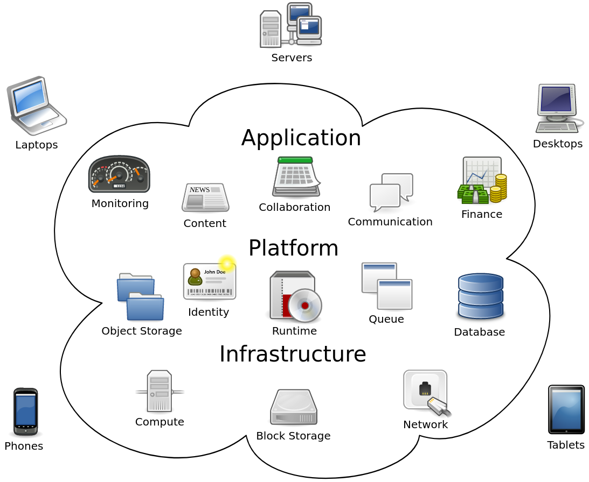

# <!--fit--> How to Cloud :cloud:
    Introduction

## Deploying **our** own cloud service
---
<!-- footer: "How to cloud - Samis Ellsaesser" -->
## Agenda

* structure of the workshop
* basic understanding of *the* cloud
* Which type of cloud service *can* and *should* we use
* Wie machen wir "cloud"?

---
## Structure

- 5 sessions
- open talk
- **today:** 
    - discussion
    - bringing everybody on the same page
#### :point_right: Goal is a functional Cloud services for all students

---
## Cloud (Computing)
    basic understanding of the cloud

- on-demand availability of computer system resources, especially
    - cloud storage and computing power
- no active management by the user

---
## Cloud (Computing)
    basic understanding of the cloud

---
## Cloud Service
    which type of cloud service can and should we use

---
## Cloud Service
    which type of cloud service can and should we use

---
## Open Source
    Wie machen wir "cloud"?
- concept of free and open source software (FOSS)

